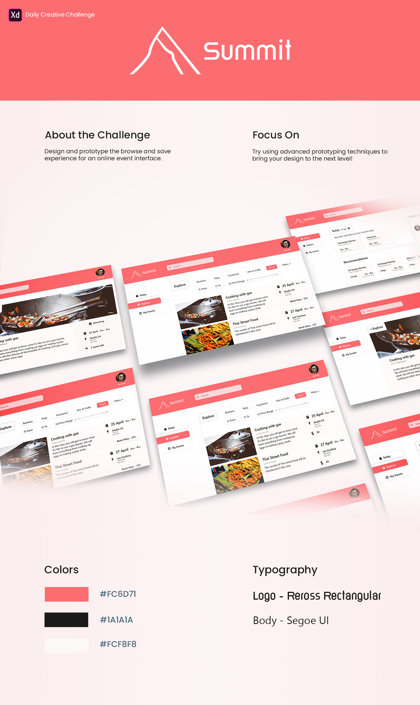
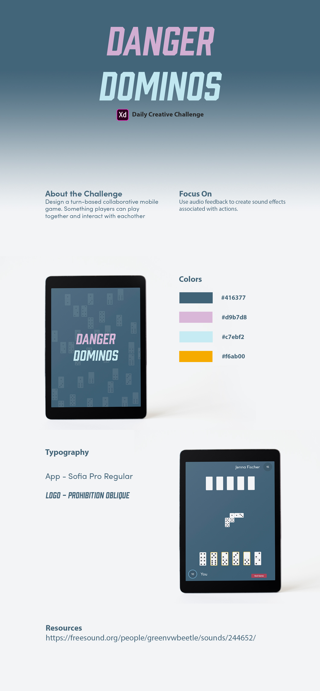
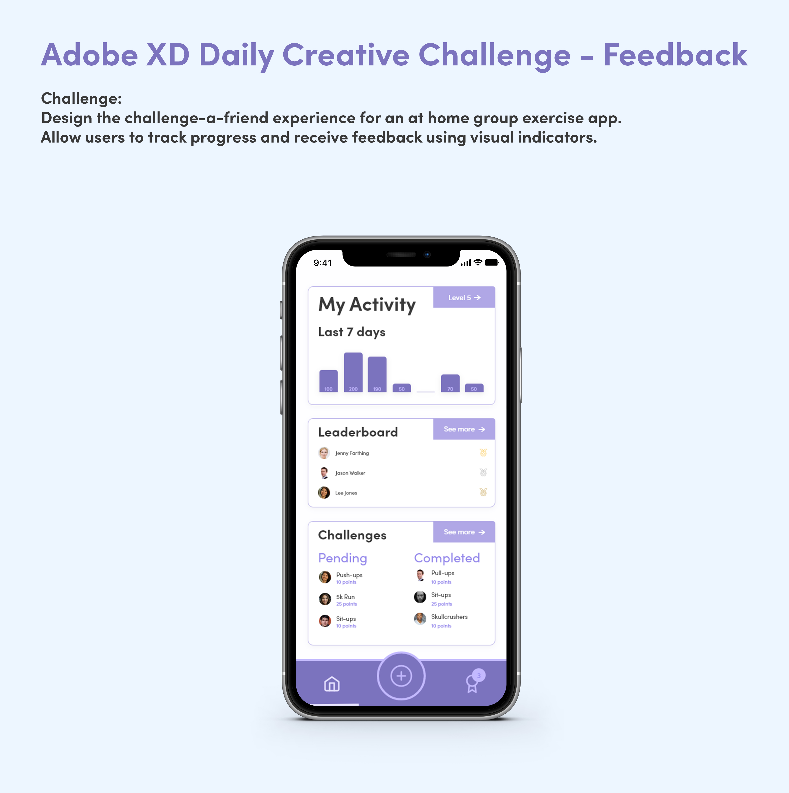
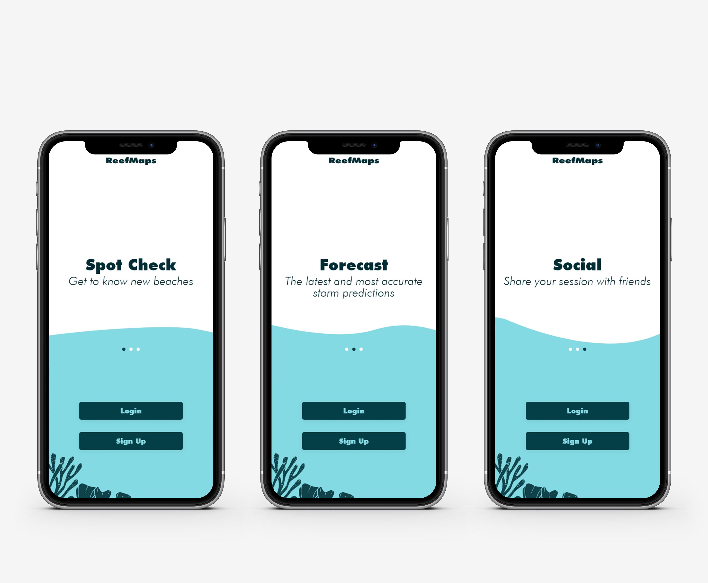

# Adobe XD Daily Challenge

Adobe does some really interesting live streams where they challenge people to design something every day. Here is a collection of the designs I came up with.

## Calendar App Summit

## Dominos game

## Exercise app

## Reefmaps Onboarding

## More Projects

[For more projects and interactive designs visit my behance profile](http://www.behance.net/rvercruyssen)
