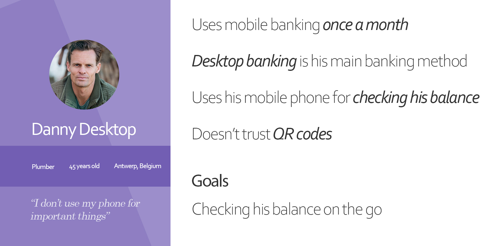

# Introduction

As I was exploring one of my banks apps, I realized it was really hard to find where the wire transfer function was. That experience inspired me to create an app that flows like none other. I decided to take a deeper dive into what users are actually doing on their phones when it comes to banking.

Disclaimer: Berbank is not a real company, I made it up. This was a project by me, for me, because I **love** designing stuff.

# User Research

To start off this project I created a poll to see which users are using their phone for mobile banking, and what their main focus is. After about 30 answers from people of all ages, the results were clear. Young people love using their phones for everything, and mobile banking is no exception. The functionality people used primarily seemed to be split down the middle between "checking balance" and "transferring money"

As an extra I included some questions about QR codes. In Belgium they've become quite popular as a method of payment, so I wanted to follow up on that trend and gather some info which people are using this. As expected it's mostly the younger generation, but people seem to be quite open to this new method of payment.

# User Personas

After analyzing the results and talking to some participants I was able to deduct the following personas. Meet Danny Desktop and Mark Mobile:

# Flow

After the users have been defined I started mapping out functionality and flow. I compared 3 different banking apps (Revolut, Belfius, Deutsche Bank) to see how they tackle problems, or where they fail to pair ease of use with functionality.

I came up with a list of capabilities the app should have:

- Log in (Biometric or passcode)
- Check Balance
- Transfer money (with and without QR code)
- View Investments
- Inbox
- Contact bank

The flows are actually quite simple and look like this:

(click to zoom)

# Mockups

## Paper

At this stage I started doing some ideation on paper.

## Figma

I have quite some experience with Adobe XD already so I decided to try out a new tool. This time I went for Figma as it's quickly gathering more and more support from the UX and UI community.

The learning curve was actually really easy coming from Adobe XD. Most of the shortcuts are the same, and the layout and functionalities are quite similar as well.

<a href="https://www.figma.com/file/H8M98HbcToxQCGBx3zqB4g/Berbank-Lo-Fi?node-id=0%3A1" target="_blank">Check out all the mockups here</a>

## Testing

The final mockups were created iteratively, by testing them on real users and observing their actions. Afterwards I would tweak some things that seemed obvious to me but weren't to the user.

# Colors

I went for a purple color palette combining a red tint to accent an outgoing transaction.

# Hi-Fidelity Screens

The final product came together quite nicely, combining all the elements of user studies, mockups, colors and so on, I came to the end result.

# Prototyping

Prototyping all of these screens together, I just went for simple interactions such as pages swiping in and out. The menu's however swipe up and down.

Supported Flows

- New Wire Transfer to new contact (contact info is already filled in)
- Transfer with QR code
- Receive with QR code
- View Accounts / Balance
- View Portfolio
- View inbox

## Give it a try

<iframe style="border: 1px solid rgba(0, 0, 0, 0.1);" width="800" height="450" src="https://www.figma.com/embed?embed_host=share&url=https%3A%2F%2Fwww.figma.com%2Fproto%2FNCunNyDLoFoBt8pkQ0Yfz0%2FBerbank-High-Fidelity%3Fnode-id%3D74%253A74%26scaling%3Dscale-down&chrome=DOCUMENTATION" allowfullscreen></iframe>

# Thanks for reading

If you learned anything, have any comments or questions feel free to get in touch in any of the following ways:

- <a href="http://m.me/raphael.vercruyssen" target="_blank" rel="noreferrer"> Chat with me on FB Messenger</a>
- <a href="mailto:raphael@vercruyssen.com">Send me an email</a>
- <a href="https://www.instagram.com/rvercruyssen/">Slide into my insta DM's</a>
