# Introduction

When I started this project it was just a proof of concept of what a potential new website could look like. Since I was also learning UX design at the time I quickly decided this was the perfect project for a UX case study. It took me about a month of research and design iterations to get to this point. Having worked at Neige Aventure for 2 years I already had a good grasp on the business side, but this time I had to put myself in the client's shoes. I'll try and share my insights in this blog post.

## My Process

- Understanding the user
- Mapping the flow
- Ideation
- Wireframes
- Testing / User feedback
- Hi fidelity wireframes
- Reflection (Lessons Learned)

# Who are we dealing with?

The company Neige Aventure / On The Mountain is a ski school and ski shop, so their core business is selling lessons, selling equipment, and renting equipment. They have lots of loyal returning customers, most of whom are also active online. A lot of families book lessons for their kids so about half the demographic we're designing for is a mom with kids. Lots of students also come to the area looking for rental equipment for one or more days. Today we can assume that most people will use their phone to do just about anything from checking the weather to filling out their taxes ([Mobile phone statistics](https://www.statista.com/statistics/241462/global-mobile-phone-website-traffic-share/))

## User Personas

I created two user personas to match our target demographic with their respective goals in mind: a student looking to book equipment for the week and a mother who wants to book a holiday for the family.
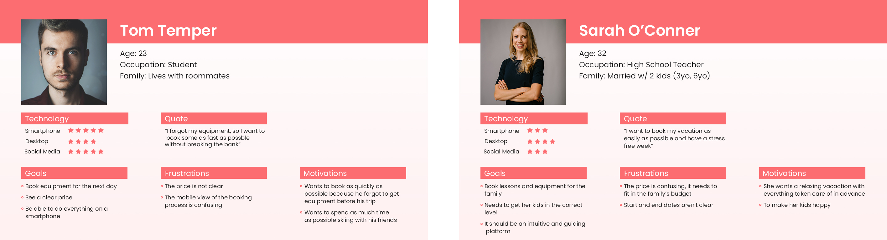

## How were these user personas created?

While I was a ski and snowboard instructor at the company, I interacted with the clients on a daily basis. I often talked with them about how they ended up with Neige Aventure and how they booked. This gave me some insight into what kind of people were coming to the website, and the problems they encountered.

# Problems we want to solve

As described by the User Personas, there are some frustrations that come up when trying to book a lesson or rent equipment on the curent site.

- The price and dates aren't always clear, as in this case (starts from CHF 55, but the actual price is 4 times that for the selected dates) and there are multiple dates shown on the screen
  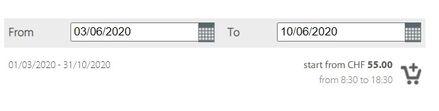

- You need some knowledge of how a ski school works to book your lesson correctly

- The site works on mobile but uses small fonts and isn't as clear as the full counterpart

# Flow

To be able to correctly solve our problems I started out mapping a basic user flow of our two main objectives: Booking a lesson and Renting equipment.

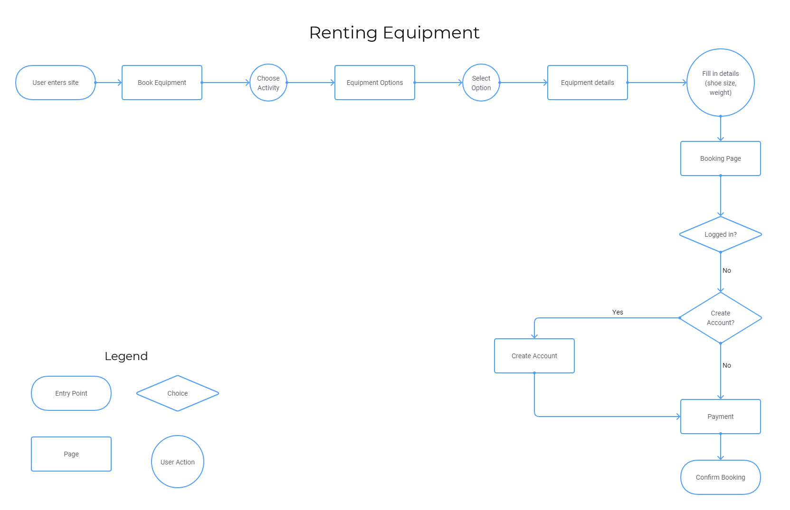
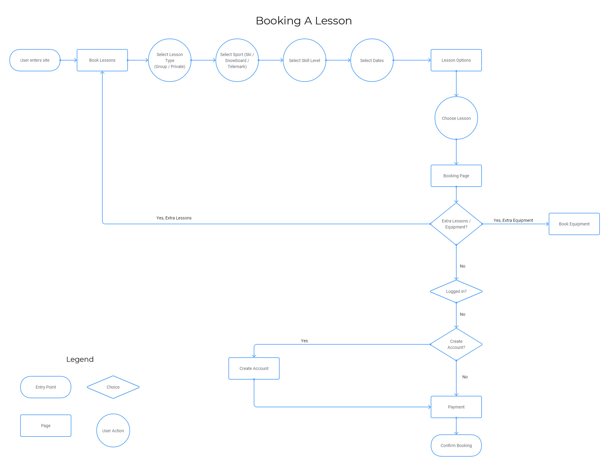

# Ideation

My next step was to get as many ideas on paper as possible. At this point I just spent about an hour or 2 drawing up everything that came to mind.
It looks a bit jumbled up and ideas bouncing from page to page, or sometimes not even in the correct order, but that's just how ideas come and go. Some are numbered, some have names. I trusted in the process of sorting all this out later when these ideas became more concrete.  
 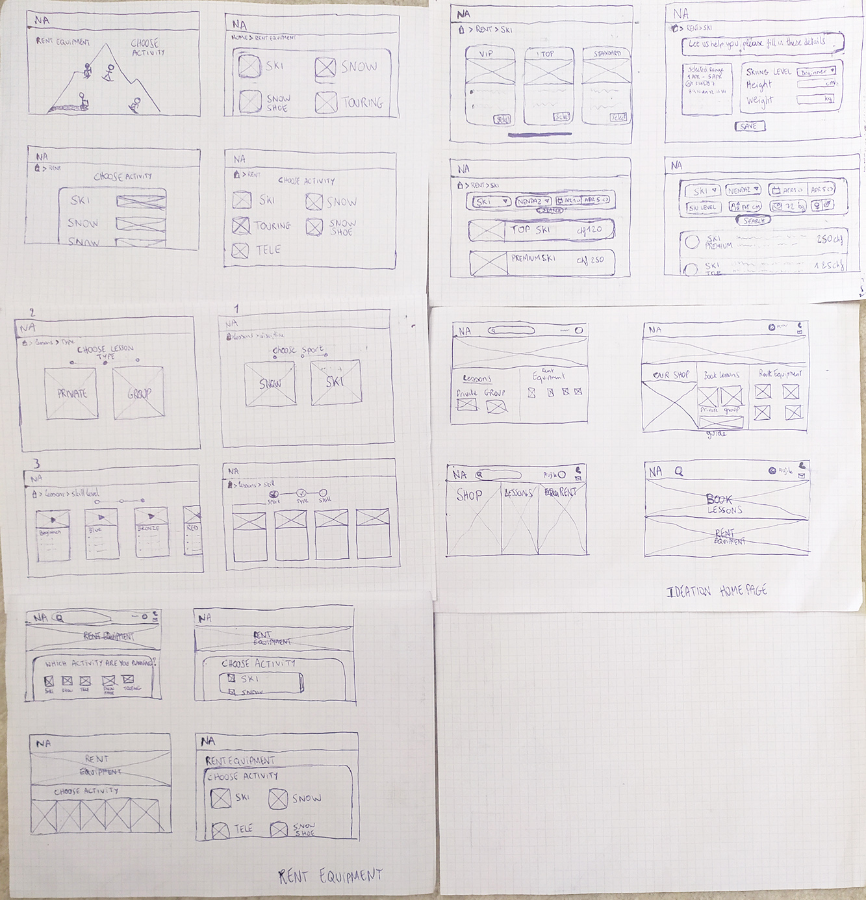

# Wireframes

Once all these ideas came to life and were safely stored on paper where I couldn't forget them, I took out my favorite wireframing tool, Adobe XD. This is where everything started feeling a little more real. I find this part to be the hardest because you want to make everything as clear as possible without distracting yourself with colors or pictures.

I wanted it to be a responsive site so I started from a mobile perspective to make sure everything would fit. Once I had the mobile version dialed in, I created a new project and remade every page for the full width website. Coming from a mobile first approach ensures that you don't leave out any information and that the browsing experience remains virtually the same regardless of which device you are on.

<a href="https://xd.adobe.com/view/0d6a7ebe-d5eb-4787-7107-7abcf3a61c64-7b5b/" target="_blank">Check out the full version of the Mobile wireframes</a>

<a href="https://xd.adobe.com/view/6c9b508e-c12e-4a65-4cdb-d6d08974bf78-1aaa/" target="_blank">Check out the full version of the Full Width wireframes</a>

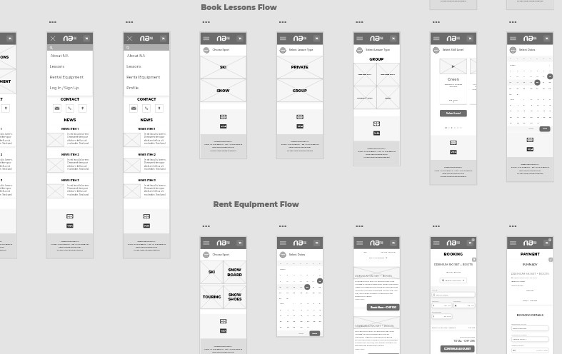
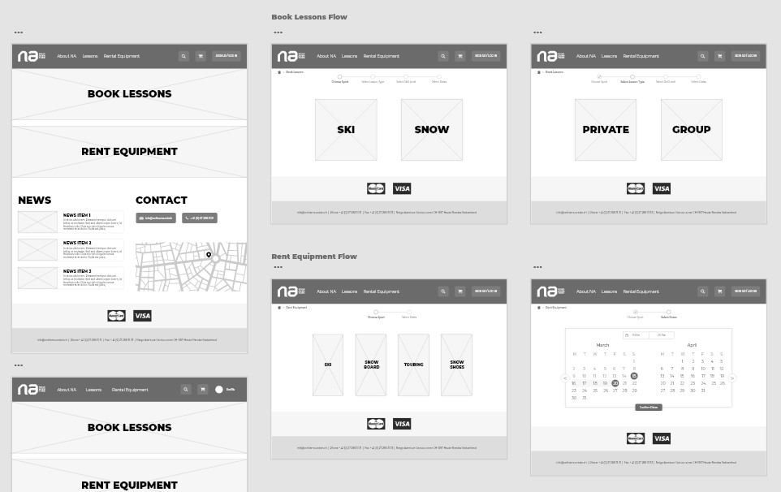

## Testing Wireframes

At this point I could build a working prototype to determine if the flow was clear. Using the prototyping tools in Adobe XD I set up everything so that you could book a lesson. I then sent out a Google form to get some answers. The responses I got all pointed towards one particular screen, so it was pretty obvious I needed to rethink how I handled choosing a level.

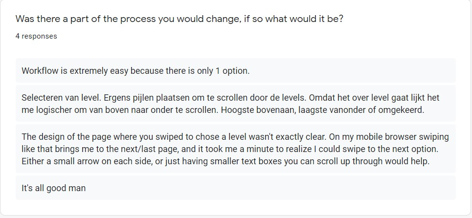

With the feedback gotten from the form and one live user test I decided to change the design of the page everyone was struggling on

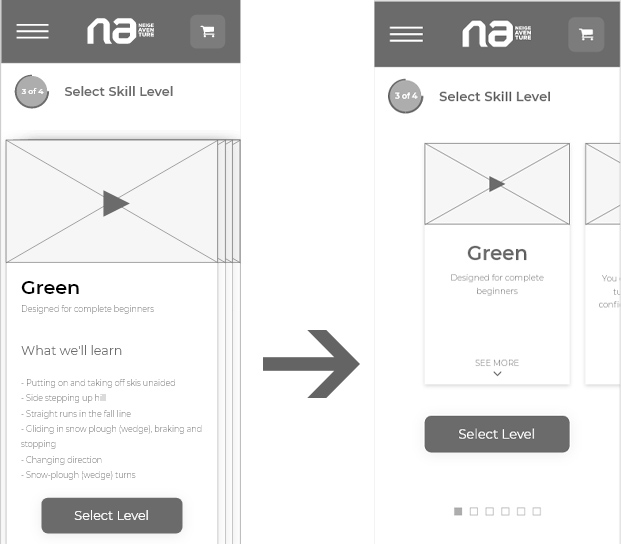

After the redesign it was a lot clearer how this page worked and reactions were much more positive.

# Adding Color

It's time for some hi-fidelity frameworks! This means, adding color images, and refining everything into a coherent design.
First of all I wanted some nice representative images of the Ski School and the people you'll meet when you book a lesson there. Lucky for me I took pictures for their marketing and social media team, so I had lots of images to choose from. First let's take a look at the color palette and the typography for this project.

## Color Palette

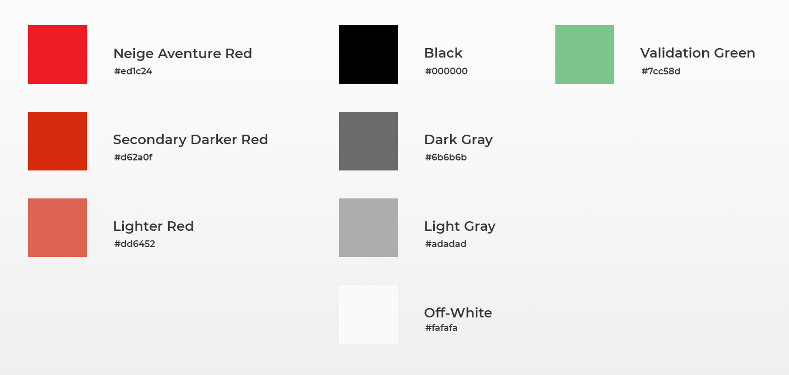

## Typography

The logo was designed using Futura, so I looked around for a font that fits into this style. After exploring around the web I ended up with [Montserrat](https://fonts.google.com/specimen/Montserrat). Luckily this font comes in 18 different styles so I could choose boldness very precisely.
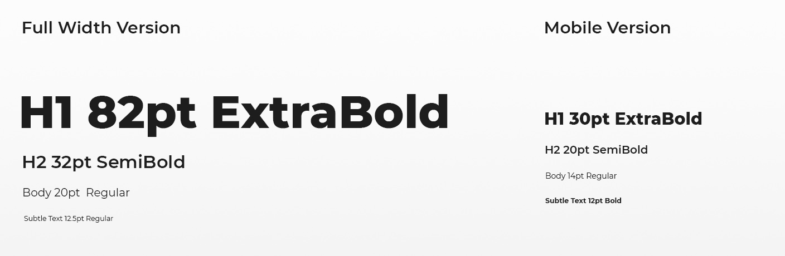

## Home

There are 3 main reasons users come to the home page:

1. They want to book a lesson
2. They want to rent equipment
3. They want to get in contact or find out the address

With this in mind the home page was born.
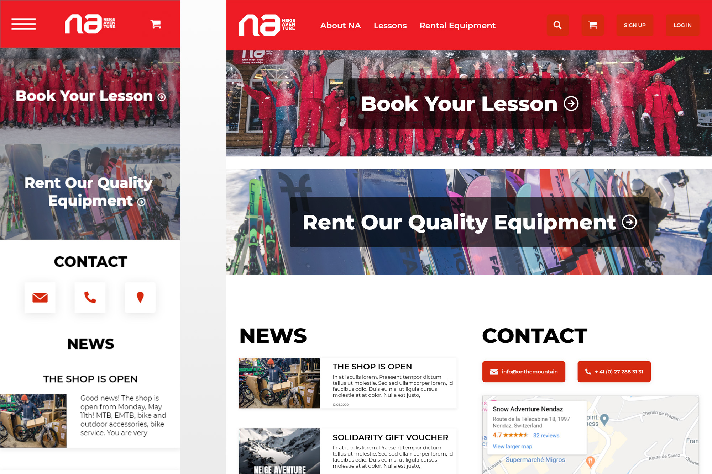

## Booking a lesson

For this flow I created a fully guided experience. Four simple questions, four easy answers and at the end of the day you've got the lesson you need.
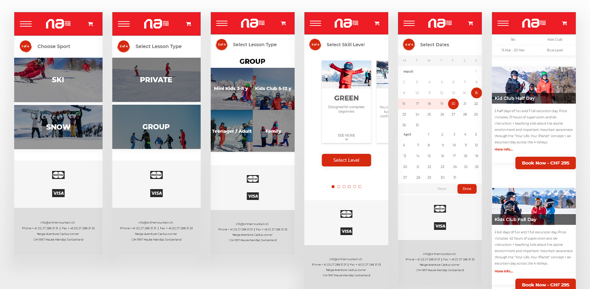

## Rent Equipment

Same goes for the equipment rental, just follow the steps and end up with what you need
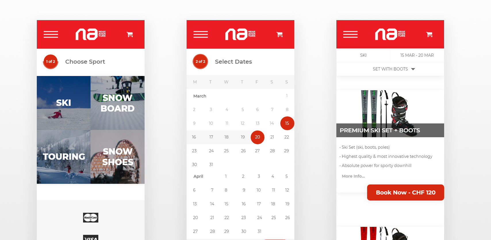

## Prototype

You can try out these prototype flows yourself. Text fields aren't editable but the general flow works with the buttons provided.

Try booking a **Kids Ski Group Lesson** for **Half a day** in the **Blue Level**

_or_

Renting a **Premium Ski Set with Boots**

<a href="https://xd.adobe.com/view/2103f981-f47f-437b-4ee9-65c569860bf2-5732/?fullscreen" target="_blank">Prototype on Adobe XD (opens in new tab)</a>
_doesn't work very well on a mobile device_

# Lessons Learned

Lastly I'd like to share some design insights I learned along the way, through research and comments I received throughout the design process.

### People don't read

When I was doing user testing on the wireframes, I received some strange comments I wasn't expecting. Basically I had set out a user goal, such as "Book a lesson" but instead of using the design someone had figured out you could manipulate the flow by using the keyboard arrows, acting as a sort of powerpoint presentation. Thus, that user test was rendered useless.

### UX copy matters

Even though people don't always read (see above), sometimes a small change in phrasing goes a long way. My two main buttons for example went through a couple different phrasings. After talking to several people which phrase they were most likely to click I ended up with "Book your lessons" and "Rent Our Quality Equipment".

### Don't be ambiguous

When you design a button, design it for one thing. I know this is a pretty basic one, but still something you should always be wary of. I almost fell into this trap by creating a "Sign Up / Log In" button.

### If you don't know, ask or research

If you don't know which way to go, ask for directions! I was stuck on the phrasing for the "Sign Up" and "Log In" Buttons. There are so many different phrases you can use to mean almost the same thing. Luckily someone already did [some research](https://www.leemunroe.com/login-vs-signin/) about this and I was able to find a pretty fast answer. If the internet doesn't know, sometimes your users do.

### Icons

Icons is a hot topic these days, everyone loves them and they can be very useful to communicate an idea quickly, but not everything needs an icon. In my wireframes I got stuck looking for an icon that would communicate "Language". Eventually I came up with a flag and thought that was pretty clever. I did some more research and came across the [5-second rule](https://www.nngroup.com/articles/icon-usability/). Eventually I threw the icons out the door on the forms because they just didn't really add anything other than a bit of eye candy.

### DONT SHOUT AT YOUR USERS

Not everything deserves to be in capital letters. Sometimes I put things in capitals that shouldn't be, like in forms for example. Capital letters make it harder to scan text and need more tracking (spacing between letters) to be legible, so on a mobile view that means losing a lot of space. Putting thing in capital letters also makes it seem as though you're being shouted at, so really consider when a text needs to be capitalised or not.

# Prototype Links

<a href="https://xd.adobe.com/view/2103f981-f47f-437b-4ee9-65c569860bf2-5732/?fullscreen" target="_blank">Full Width Prototype on Adobe XD (opens in new tab)</a>
<a href="https://xd.adobe.com/view/0d6a7ebe-d5eb-4787-7107-7abcf3a61c64-7b5b/?fullscreen" target="_blank">Mobile Prototype on Adobe XD (opens in new tab)</a>

**Prototype tool doesn't work very well on mobile, use laptop for best experience**

# Thanks for reading

If you learned anything, have any comments or questions feel free to get in touch in any of the following ways:

- <a href="http://m.me/raphael.vercruyssen" target="_blank" rel="noreferrer"> Chat with me on FB Messenger</a>
- <a href="mailto:raphael@vercruyssen.com">Send me an email</a>
- <a href="https://www.instagram.com/rvercruyssen/">Slide into my insta DM's</a>
